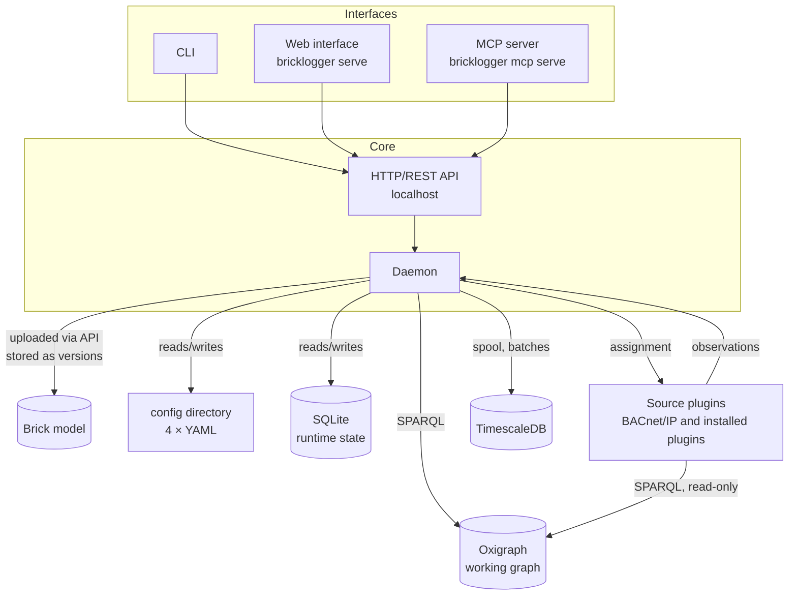
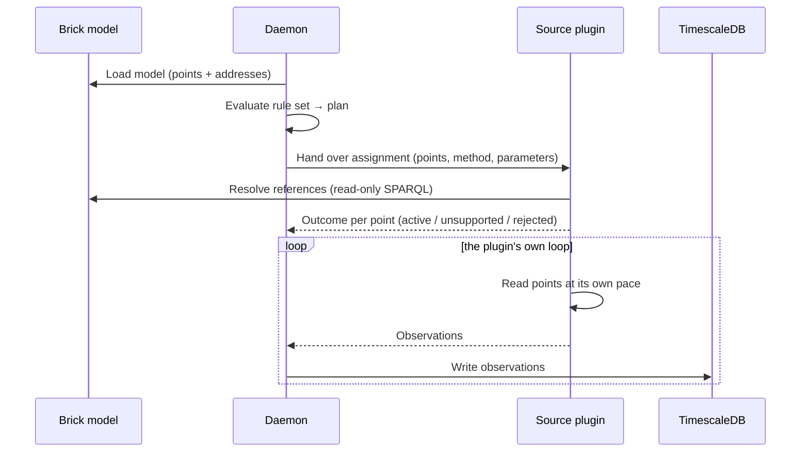

# Architecture

## Overview

Bricklogger consists of a long-running **daemon** that collects data, a
**CLI** that controls it, a **web interface** served by `bricklogger serve`
that builds on exactly the same API as the CLI, and an **MCP server**,
`bricklogger mcp serve`, through which an AI assistant configures the logger
over that same API.



## Components

### The daemon

The daemon is the core. On startup it loads the configuration and the active
version of the Brick model, evaluates the rule set into a poll plan and starts
collecting. If no model exists yet, the daemon starts in an **idle state**:
the API and status work, but nothing is polled until a model has been
uploaded. The daemon:

- hands assignments to the sources (BACnet/IP and any installed source
  plugin) based on the
  rule set and receives their observations,
- writes observations to the destinations (first version: TimescaleDB),
- keeps runtime state (e.g. last poll time and error counters) in a local
  SQLite database in the data directory — never in the configuration files,
- exposes an [HTTP/REST API](features/api.md), by default on localhost only,
  with [health and status endpoints](features/daemon.md#status), all control
  and configuration operations, and a SPARQL endpoint (queries only) against
  the working graph.

### The CLI

The CLI is the control plane and the primary user interface. It talks to the
daemon over the HTTP API: status, configuration, model versions, SPARQL
queries, plugin tools and start/stop of plugin instances. The commands are
defined in the [CLI document](features/cli.md).

When the daemon is not running, the CLI can work **directly on the
configuration files** with the same validation as the API. A system can
therefore be set up from scratch without a running daemon (bootstrap).

**Protocol tools.** For every supported protocol the CLI offers commands to
interact directly with the protocol — e.g. device discovery and reading of
objects — for setup and troubleshooting on site. For BACnet/IP the tools build
on a wrapper of [bacpypes3](https://github.com/JoelBender/BACpypes3).

The protocol commands follow the same fallback model as the configuration:
when the daemon is running, the command goes through its API (so the daemon
remains the only actor on the network socket, and the web interface offers the
same); when the daemon is not running, the CLI talks on the network directly.

### The web interface

The web interface is a separate process, started with `bricklogger serve`,
that talks to the daemon's HTTP API exactly as the CLI does and serves
browsers on a port of its own. It has full parity with the CLI: there is no
functionality that can only be reached through the web — or only through the
CLI. Its functionality is defined in the [web document](features/web.md).

### The MCP server

The MCP server is a third process, `bricklogger mcp serve`, that speaks the Model
Context Protocol to an AI assistant and talks to the daemon's HTTP API as the
CLI does, with the CLI's fallback to the files when no daemon runs. It is made
for configuration: it carries the schemas, the documentation and the plugin
catalogue as resources, and its tools map one to one onto the CLI's
configuration commands and read-only views. It uploads no models and operates
no instances. Its functionality is defined in the
[MCP document](features/mcp.md).

## The Brick model

The Brick model is a semantic graph describing the building: equipment, data
points and their relationships. The points' **physical addresses** (e.g.
BACnet device and object references) are also in the graph, following Brick's
standardised external references (ref-schema). Where Brick's reference schema
has a type for a system, the reference is written in it; where it has none — a
cloud service such as iBOS — the source plugin brings a small
[vocabulary](#declaration) of its own. Brick's `ref:TimeseriesReference` says
where a point's time series is **stored**; it is reserved for the databases
Bricklogger writes to and is never a source's address. Bricklogger states it
itself, beside the model rather than in it: in a
[graph of its own](#the-working-graph) per destination and in the databases
that [store the model](#the-model-in-destinations), so a point's time series
can be found from the model.

Bricklogger treats the graph as **read-only input**: it is produced and
maintained by other tools. Bricklogger never defines points outside the model
and never writes to it.

**Brick and RealEstateCore.** Brick 1.5 models the spaces of a building —
site, building, levels, rooms and zones — with RealEstateCore (`rec:Building`,
`rec:Level`, `rec:Room` and its kinds, `rec:HVACZone`) and keeps its own
spatial classes only as deprecated aliases. Bricklogger follows: a location is
a Brick `Location` or a RealEstateCore space, `rec:isPartOf` and
`rec:locatedIn` are the part and location relations beside Brick's
`isPartOf` and `hasLocation`, which Brick declares as their equivalents, and
points, equipment and their relations stay Brick's. An HVAC zone within a
room is `rec:isPartOf` the room; a zone that spans rooms has them as parts,
`rec:hasPart`; both occur, and the rule set's
[location selector](features/daemon.md#match-simplified-selectors) reaches a
zone's points from its rooms either way. Bricklogger ships its own
copy of Brick — 1.5.0-rc1 at the time of writing, with the RealEstateCore
alignment and the reference schema — so validation and inference need no
network and do not depend on any library's bundled copy. The deprecated Brick
classes still validate on their own, but not mixed with RealEstateCore in one
hierarchy — a `rec:Level` as part of a `brick:Building` fails the old class's
shape — so a model chooses one vocabulary for its spaces, and a new model
chooses RealEstateCore.

### Lifecycle: upload, versions and replacement

The model is delivered to the daemon as an **upload through the API** (from
the CLI or the web interface). The daemon stores it in the data directory and
reloads the active version on restart.

The model can be **replaced in operation** with the same semantics as a
configuration reload: the new model is validated first; if it is invalid, it
is rejected with an error message and the daemon continues on the running
model. If it is valid, it is swapped atomically, the rule set is re-evaluated
into a new poll plan, and points that no longer exist in the model leave the
plan.

**What validation checks.** The model is validated against Brick's shapes,
and only violations on the model's own nodes reject it. Reference nodes are
exempt: what a reference must look like is the source plugin's business, and
the plugin reports what it cannot use as `rejected` with a reason. Values from
QUDT's vocabulary, such as units, are not verified against QUDT, because the
bundled Brick ontology does not carry QUDT's own type assertions. Warnings,
such as deprecated classes, are reported with the upload but do not reject it.

**Every upload is a version.** The daemon keeps every uploaded model with a
timestamp and remembers which version was active when. Versions can be listed
and exported, and an earlier version can be **reactivated** with the same
validation and atomic swap as an upload — a new model that turns out to be
wrong is rolled back the same way it came in.

**Diff between versions.** The result of an upload shows the difference to
the previously active version: points added, removed or changed — e.g. moved
to another piece of equipment or room, or re-addressed. The same diff can be
retrieved later for any two versions. The diff is computed on what was
uploaded, not on the inferred graph.

Versions carry **the model, not values**. Value history is the time series'
job, and the graph shows at most a current snapshot.

!!! note "Prerequisite: stable URIs"
    The history hangs on the points' URIs. A point that gets a new URI in a new
    version is a new point in the time series, and its history breaks. That
    puts a requirement on the tool that builds the model: same point, same URI,
    version after version.

### The working graph

The daemon does not work directly on the model file. When a version is
activated, it is validated against Brick's shapes and loaded into a
**working graph**: an
[Oxigraph](https://github.com/oxigraph/oxigraph) store in the data directory,
where all queries — rule evaluation, status, API and the source plugins'
reference lookups — run as SPARQL. The store holds these named graphs:

- **the active model version**, as uploaded — Bricklogger never writes to it,
- **the ontology**: the bundled Brick with its RealEstateCore alignment, and
  the vocabularies the installed source plugins declare,
- **the inferred graph**: everything that follows from model and ontology
  under OWL-RL — superclasses, inverse relations and the rest of what Brick
  declares,
- **the value overlay**, where every point carries `brick:lastKnownValue`
  with the latest **valid** value and its timestamp — the latest by
  timestamp, not by arrival, since a history source can deliver an older
  sample after a newer one — as a node with `brick:value` and
  `brick:timestamp`. `null` observations do not change it,
  so the age of the timestamp shows that the point is silent or in fault.
  `enum` and `boolean` are shown as **text**, not ordinals, so the graph can
  be read without metadata; the ordinal stands in while the texts are not
  yet known. The overlay is updated in batches from runtime state, every few
  seconds, and rebuilt whenever the plan changes, so a point that leaves the
  plan leaves the overlay. It is a current snapshot, not a history.
- **the time-series references**, one graph per destination instance that
  [stores the model](#the-model-in-destinations): every point of the active
  version that the destination holds data for carries
  `ref:hasExternalReference` to a `ref:TimeseriesReference` whose
  `ref:hasTimeseriesId` is the destination's own key for the point's time
  series — the same references the destination stores with the model. The
  graph is the instance's, so a reference carries no `ref:storedAt`. It is
  rebuilt with every plan.

**Inference.** On activation, the full OWL-RL closure of model plus ontology
is derived with the Rust-based reasoner (`reasonable`), and the
inferred triples are placed in the inferred graph. The SHACL rules of Brick's
reference schema run in the same step, together with Bricklogger's own
supplementary rules and the rules of the source plugins' vocabularies, so a
reference node the model leaves untyped — Brick's own examples do — gets its
type: `ref:BACnetReference`, derived in either of the two BACnet vocabularies
found in models, or the reference type of an installed plugin's vocabulary;
the daemon's classification of
references relies on it. All of this
takes from seconds to minutes depending on the size of the model and happens
once per activation; the running model is unaffected until the new one is
ready. Raw SPARQL can therefore write `?p a brick:Temperature_Sensor` and hit
all subclasses, and relations can be followed in both directions. Transitive
part hierarchies — "everything on floor 1" — are Bricklogger's own selector
semantics, not something Brick declares, and are expressed at query time with
property paths such as `brick:isPartOf*`.

Queries run over the union of the graphs. The time-series references join
that union only on the SPARQL endpoint: the rules, the plan, the model
explorer and the sources' reference lookups see the model's own references
alone, so a reference Bricklogger wrote never passes for an address. Export
gives by default **the model alone, as uploaded**; the inferred graph, the
values and a destination's time-series references are opt-in. The SPARQL
endpoint on the API gives read access to all of it, and
`GRAPH <urn:bricklogger:timeseries:INSTANCE>` narrows a query to one
destination's references.

The store is **derived state**. The truth is the version files and the
runtime state; if the store is deleted, the daemon rebuilds it on the next
start.

## Configuration

All configuration lives in a **config directory** with four YAML files —
`daemon.yaml`, `sources.yaml`, `destinations.yaml` and `rules.yaml` — which
together are the source of truth. The files are human-readable and belong in
version control. The schema is defined in the
[configuration document](features/configuration.md).

**Write paths.** Changes normally go through the daemon's API (from the CLI,
the web interface or the MCP server), which validates and writes the files
atomically — the configuration can
therefore not become invalid that way. The files can also be edited directly.

**Reload.** When the files are changed outside the API, the changes take
effect only when the user performs a reload through the CLI. On reload the
configuration is validated as a whole; if it is invalid, it is rejected with
an error message and the daemon continues on the running configuration.

**Secrets.** The configuration can interpolate environment variables (e.g.
`${TSDB_PASSWORD}`), which the daemon fills in when loading. Secrets never
appear in the files themselves. Beside the four files the config directory may
hold an **`env` file** of `NAME=value` lines, which the daemon and the CLI read
before they interpolate, so a command needs no exported variables; the process
environment wins over the file. The file is not part of the configuration API
and is never printed.

## Point selection: the rule set

Which of the graph's points are logged — and how often — is determined by an
**ordered rule set** in the configuration, evaluated like rules in a
firewall:

- Rules are evaluated **top down**; **the first match wins**.
- A rule either **logs** (with a polling frequency) or **excludes** ("deny").
- Points that no rule matches are **not** logged (implicit deny).
- Points are selected with **simplified selectors** (e.g. Brick class,
  equipment, location) or **raw SPARQL** as an escape hatch. The selectors'
  vocabulary and semantics are defined in the
  [daemon functionality](features/daemon.md).

!!! example "Example"
    The full YAML schema is defined in the
    [configuration document](features/configuration.md):

    ```yaml
    # rules.yaml
    - name: Exclude test room
      match: { location: "ex:Room_1_17" }
      action: deny
    - name: Ventilation temperatures
      match: { class: brick:Temperature_Sensor, equipment: "ex:AHU_01" }
      action: accept
      method: poll
      interval: 5m
    - name: All energy meters
      match: { class: brick:Energy_Sensor }
      action: accept
      method: poll
      interval: 15m
    # everything else is not logged (implicit deny)
    ```

## Plugins: sources and destinations

Sources and destinations are **plugins** behind one common contract per role —
and the built-in ones — BACnet/IP and TimescaleDB — follow **the
same contract** as custom plugins. There is no privileged code path: if the
contract can drive BACnet/IP, it can also drive a site-specific API.

Custom plugins are distributed as **Python packages**, installed in the
daemon's environment and discovered through **entry points**. Dependencies
and versioning thus follow the package, and the daemon finds plugins without
extra configuration. A plugin is built on the **plugin SDK**, `bricklogger.sdk`,
the one public surface of the package: the contract, the declaration, the
configuration value types and a test kit are importable from there, and
nothing else in Bricklogger is. The contract is stable within a **minor
version** of Bricklogger: a change to it raises the minor version, and a
plugin pins the minor version it was built for. How a plugin is installed,
written, tested and distributed is on the [plugins page](features/plugins.md).

### Execution model for sources

The daemon owns **the plan**, the plugin owns **the execution**. The rule set
is evaluated into a plan that is split into **one assignment per source
instance**: which points, with which collection method and which parameters.
The assignment is handed over as **full desired state** — not as changes —
together with a sink for observations and a channel for status. On reload or
a new model, a new desired state is simply handed over, and the plugin works
out for itself what to start, stop and leave alone.

The plugin then runs **its own** loops and subscriptions and pushes
observations into the sink. The daemon has no scheduler: it computes,
delegates and receives. How a plugin paces its work — one round per interval,
a spread start, rounds skipped when one outlasts its interval — is the
plugin's own: the SDK offers no loop, and the contract asks for none.

### Which source owns which point

The plan can only be split into assignments once the daemon knows which source
instance serves which point. The graph does not answer that: it carries the
point's address — which device, which object — but not which network
interface on which machine can reach that address. That is an operational
condition, not a property of the building.

Therefore **the plugin claims**. Each source instance reads the graph's
external references itself, through the
[read-only graph access](#graph-access-for-sources) every source has, and
answers with the points it serves. The answer is decided **statically** from
the plugin's own configuration — address, subnet, device range — without
touching the network. The binding can therefore be validated and shown before
the daemon starts collecting.

An instance without a network restriction claims all references of its type.
On an installation with one source, the coupling thus requires no
configuration.

**Arbitration.** An instance claims without knowing the rule set, and the
daemon then decides the claims for the points the rule set **accepts** — the
graph may well describe more than this installation collects, without status
drowning in warnings. A point can carry several external references, e.g. a
BACnet reference and a time-series reference; if one source claims the point
through one of them, the point is covered.

| Case | Handling |
|------|----------|
| Nobody claims | The point is not collected; **warning** in status with the point's URI |
| No installed source understands any of the point's references | As above, with a message about the reference type |
| The point has no external reference | As above, with a message about the missing reference |
| Several claim the same point | **Validation error** naming the point and the competing instances |

The warnings are not validation errors: one new point in the graph must not
be able to topple a running configuration — the same philosophy as for a
missing `fallback`. A double claim, on the other hand, is an error in the
source configuration that would mean double collection or an arbitrary
choice, and it hits the operation that creates the conflict: a reload is
rejected and the running configuration is kept; a model activation is
rejected the same way, because the fix lies in `sources.yaml`.

### Isolation and resources

**One source instance is one isolation unit:** every plugin runs in its own
thread with its own event loop, and the sink is thread-safe. A blocking
protocol library therefore cannot slow down the other sources. The contract
is transport-agnostic, so the isolation can later be tightened to separate
processes without changing it.

A plugin **declares the exclusive resources** it claims, as opaque strings —
e.g. `udp:0.0.0.0:47808` or `serial:/dev/ttyUSB0`. The daemon only compares
the strings and rejects collisions at validation, without knowing what a
socket is.

**The protocol tools** in the CLI are addressed per source instance, and the
daemon routes the command to the plugin that owns the connection.

### The phases of the contract

The contract follows a plugin's life in six phases: **declaration**,
**configuration binding**, **binding to the model** (resources and claims),
**operation** (start, assignment, acknowledgement, observations, metadata,
status), **protocol tools** and **stop**. All six are defined here.

### Declaration

Plugins are discovered in the entry point groups `bricklogger.sources` and
`bricklogger.destinations`; the entry point name is the type name written in
`type` in the configuration. The declaration is **static** and can be read
before any instance exists — so the CLI can list installed plugins, and the
daemon can validate the configuration without starting anything. The entry
points are read when the daemon starts, so a plugin installed or removed while
it runs is seen at its next start. A source declares:

- **the type name**,
- **the reference types** it understands, e.g. `ref:BACnetReference` — so the
  daemon can warn about accepted points whose references no installed source
  understands,
- **a vocabulary**, when the source's system has no reference type in Brick's
  reference schema: the prefix and namespace of the source's own reference
  type and a Turtle document with its classes, properties and SHACL rules,
  shipped in the plugin's package. The daemon loads the vocabularies of every
  installed source at activation together with Brick's ontology and rules, so
  the reference nodes get their type and the classes their place under
  `ref:ExternalReference` without any network access, and it pre-declares the
  prefix. The vocabulary of the [iBOS source](https://github.com/CX1-ApS/bricklogger-ibos) is one,
- **the collection methods**, with a parameter schema per method. `poll` with
  `interval` is defined centrally by Bricklogger and opted into by the source;
  source-specific methods, each with its own parameters, are defined by the
  source itself. The daemon validates `rules.yaml` against the schemas without
  knowing the methods,
- **the configuration schema** for the instance's own settings,
- **the protocol tools** it offers.

A destination correspondingly declares its type name, its configuration
schema, whether it stores metadata and whether it stores the model.

Schemas are written as **pydantic models**. The plugin gets typed objects,
errors become precise, and JSON Schema can be derived automatically, so the
contract stays transport-agnostic.

**A plugin that cannot be loaded stops nothing.** An entry point whose import
raises, or whose declaration is of the wrong role or carries another type
name than the entry point, is recorded with its error instead of ending the
load. The catalogue lists the plugin with the error where its description
would be, its configured instances are `failed` in status with the same error
and raise `instance_failed`, validation warns about them instead of checking
their settings, and every other instance runs. A configured type that no
installed plugin provides — a plugin not yet added after an upgrade, one a
container could not lay down, or a misspelt name — is treated the same way
when the daemon starts: its instances are `failed` with the error that the
type is not installed. A change written through the CLI, the web interface,
the API or the MCP server is refused when an instance it adds or changes
names such a type, so a misspelling is caught where it is typed.

### Configuration binding

The daemon owns the binding: it fills in environment variables, validates
every instance in `sources.yaml` and `destinations.yaml` against the type's
configuration schema, and creates the instance with the validated, typed
configuration. Errors name the instance and the key. The plugin never reads
YAML itself. A setting that is a secret is marked in the schema with the JSON
Schema format `password`, as `password` and `token` are in the built-in
plugins; the CLI then asks for it without echo, keeps it in the `env` file and
refuses to write it into a configuration file.

### Binding to the model

Binding happens at every plan computation — reload and model activation — and
without touching the network:

- **Resources.** The configured instance states the exclusive resources it
  claims, as opaque strings. A collision between instances is a validation
  error.
- **Claims.** The instance finds the external references of its declared
  types in the graph itself, decides from its own configuration which of them
  it serves, and answers with the **point URIs**. The daemon hands over
  nothing about references: it intersects the answer with the accepted points,
  arbitrates as described above and computes the assignment.

### Graph access for sources

A source plugin reads what it needs about its points **from the graph
itself**: it receives a query function that runs **read-only SPARQL** against
the [working graph](#the-working-graph) — model, ontology, inferred graph and
value overlay — with the same semantics as the API's SPARQL endpoint. The
plugin may query **at any time**, during claiming and in operation alike.
Every model activation leads to a new binding round — claim and a full
assignment — in which the plugin resolves its references again against the
new model. A query is a call with a response, so the access survives a later
move of plugins into separate processes.

Only sources have this access. Destinations remain pure write targets with
the closed [metadata](#point-metadata) the daemon offers them.

### Operation

Operation is the plugin's own life in its own thread:

- **Start.** The plugin receives a thread-safe **sink** and a **status
  channel** and starts its loop.
- **Assignment.** The daemon hands over full desired state: per point its
  URI, the name of the collection method, the typed parameters, and the
  **latest observation** the daemon has recorded for the point, if any — the
  timestamp held in the runtime state, which survives a restart. The plugin
  resolves each point's reference from the graph itself. The assignment is
  idempotent, and the plugin works out for itself what to start, stop and
  leave alone. A history source resumes from the latest observation, so a
  restart of the daemon or of the instance refetches nothing.
- **Outcome per point** is reported on the status channel as a state that can
  change over time: `active`, `unsupported` when the device cannot do the
  method, or `rejected` with a reason. It is reported initially and again on
  change, because whether a device supports a method is often only known when
  it is attempted, and it can change when a device is replaced.
- **The daemon owns fallback.** When the plugin reports `unsupported`, the
  daemon hands over a new full desired state in which the point carries the
  rule's `fallback`. Without a fallback the point is not collected, with a
  warning. `rejected` gives a warning with the reason.
- **Observations** are pushed into the sink, singly or in batches.
- **Metadata** is delivered through the sink as full desired state, first
  when the plugin knows it — typically after reading units and state texts —
  and again on change.
- **The status channel** carries state per instance, device and point, and
  warnings a source raises with a code of its own, such as `rate_limited`, and
  withdraws again. What status shows is a separate topic; the contract only
  fixes that the channel exists and what it carries.

Rule semantics stay in the daemon: the plugin never sees a fallback, only the
method it is asked to run. What a protocol plugin needs to know about a point
— its reference, the device behind it and the device's address — it reads
from the graph itself, so the plugin, not the daemon, knows the shape of its
reference type.

### Protocol tools

A tool is declared with a name, a description, a parameter schema as a
pydantic model, and a **structured, JSON-serialisable result**. The CLI renders
the result as a table for humans and can emit it raw for scripts, and the same
result travels unchanged over the API — which is what gives the web interface
parity.

A tool may declare its result a **document**: one JSON object meant to be kept
as a file rather than read as a table — an export, such as a point list. The
result travels over the API exactly as any other; what changes is the
presentation. The CLI writes a document as JSON, to standard output or to a
file with `-o FILE`, and the web interface offers it as a download named after
the instance, the tool, the values given for its parameters and the day,
instead of rendering it. The plugin declares nothing else; the flag on the
tool is enough, and both interfaces handle every document tool of every plugin
the same way.

A document tool may also say **where the web interface offers it**: on the
rows of another tool, with a parameter filled from a named column — the point
list on the rows of the project listing, the project number from the `number`
column. The web interface then puts a download on every row of that tool's
result, and one for the whole document above the rows when the document needs
no parameter, and gives the document tool no form of its own. The CLI is
untouched by the offer; the document tool remains a command with its
parameters as flags.

Execution goes through the daemon to the instance that owns the connection,
and the tool runs **inside the plugin's own loop**, so the socket keeps one
actor. Without a running daemon, the CLI binds the configuration itself and
runs the tool in-process. Long-running tools, such as discovery that listens
for replies for several seconds, declare their duration as a parameter and
return a complete result when done; there is no streaming in the first
version. A tool failure is an error result with a message, never a crash of
the instance.

Which tools a source offers belongs on the [sources page](features/sources.md).

### Stop

Stopping is **graceful with a deadline**: the plugin cancels subscriptions,
closes sockets and flushes what it holds into the sink. The deadline is
`stop_timeout` in `daemon.yaml`, default 10 seconds. A plugin that misses the
deadline is **abandoned and reported in status** — Python cannot force a
thread to stop. That is the honest limit of thread isolation, and one more
reason process isolation can come later without changing the contract.

- **Restart of one instance.** A reload that changes an instance's
  configuration stops that instance and starts a new one; the other instances
  are untouched. A reload that does not touch an instance leaves it running,
  possibly with a new assignment.
- **Crash.** An uncaught exception in the plugin's loop marks the instance as
  **failed** in status with the error, and the daemon restarts it with
  exponential backoff, capped. The daemon emits no observations on behalf of
  a dead plugin — it never stamps anything itself.
- **Daemon shutdown** stops all instances with the same deadline and then
  flushes the destinations.
- **Operator stop.** An instance can be stopped and started from the CLI. A
  stopped instance stays stopped across reload and daemon restart until it is
  started again, shows as `stopped` in status and as the warning
  `instance_stopped`.

### The destination contract

Declaration and configuration binding are shared with sources. The rest
mirrors the source contract, only simpler, and every destination instance runs
in its own thread:

- **Start.** The destination connects and prepares its storage — TimescaleDB
  creates its tables if they are missing. A destination that cannot start is
  marked **failed** in status and retried with backoff, while its spool keeps
  filling. **Collection never stops because a destination is down.**
- **Write.** The destination receives a **batch** of observations and either
  succeeds or raises. On failure the batch stays in the spool, and before the
  retry the destination is **stopped and started again**, so that a connection
  the far end has closed is replaced rather than used again. The runner cannot
  tell a broken connection from any other fault, so every failed write is
  followed by a fresh start; a destination that then cannot start is retried
  with the same backoff. The instance stays **failed** in status, and its
  warning stands, until a write actually succeeds.
- **Delivery is at-least-once.** A batch leaves the spool only when the write
  succeeded, so a crash between write and acknowledgement can repeat a batch.
  Destinations must therefore **write idempotently**; for TimescaleDB a unique
  key on point and time makes a repeat harmless.
- **Metadata** is offered to destinations that declared they store it, in the
  same full-desired-state form. It travels through the same spool, so order is
  kept: the graph's part of a point's metadata precedes the point's first
  observation, and the plugin's part follows when known.
- **The model** is offered to destinations that declared they store it. The
  daemon asks the destination for its keys — point URI to time-series id —
  adds a `ref:TimeseriesReference` per point to the version as uploaded, and
  hands the result over as Turtle with the version's upload and activation
  times; the destination stores text and needs no RDF. The model travels
  through the spool behind the metadata, so every point the plan has offered
  already has its key. The active version is offered with every plan, and
  every version that has been active once when the instance starts. Writing
  a version again replaces it, so a repeat is harmless.
- **Stop.** The destination flushes what is in flight and closes, within
  `stop_timeout`. Whatever is not yet written stays in the spool for the next
  start.

### Backpressure: the spool

**Destinations never slow down collection.** Between the daemon and each
destination instance sits a **persistent spool** in the data directory: an
on-disk queue that observations are appended to and drained from in order, in
batches. It survives a daemon restart, and it decouples the destinations from
each other, so a slow one never stalls a fast one.

The spool is bounded by **size** and **age**, configurable per destination
with defaults of 1 GB and 7 days. When a cap is reached, the oldest
observations are dropped, and status shows the spool depth and the drop count.
The settings are described in the
[configuration document](features/configuration.md#sourcesyaml-and-destinationsyaml).

## Observations and metadata

Sources and destinations meet only in the daemon, and they share only two
things: **observations** and **point metadata**. Both vocabularies are
**closed** — a plugin cannot invent new types or fields. That is what makes
five sources and three destinations eight plugins to maintain rather than
fifteen combinations.

### The observation

An observation carries **point, timestamp, type and value** — and nothing
else. Meaning belongs to the point, not to the individual measurement: the
states of an operating-mode point do not change from reading to reading, and
the time series is the only thing in the system that grows without bound.

**The timestamp belongs to the source.** It is the source plugin that
delivers the observation, and it delivers it with a timestamp; the daemon
never stamps anything itself. The timestamp states when the value applies, as
well as the source knows it. If the protocol carries no time — a BACnet read
does not — the source stamps at reading with the machine's clock. A source
that receives timestamped samples, e.g. history or an external API, passes the
sample's timestamp on.

Under polling the timestamp therefore says that the value *was* valid at that
time; how long before it became true can only be bounded by the poll
interval.

Three conventions apply to all sources:

- Timestamps are always **timezone-aware** and stored as **UTC**.
- Live reads are stamped **when the response is received**, with the actual
  time — not the scheduled one. A combined read of several points thereby
  gets one shared timestamp.
- The daemon **rejects** observations with a timestamp in the future beyond a
  small tolerance and counts them as errors. A plugin that passes on device
  time must say so in its documentation.

The value type comes from this closed vocabulary:

| Type | Content | Typical source |
|------|---------|----------------|
| `number` | Floating-point number | Analogue points, scaled registers |
| `integer` | Integer | Counters, run hours |
| `boolean` | True/false | Binary points, coils |
| `enum` | Ordinal — the texts are in metadata | Operating modes (Manual/Auto/Off) |
| `string` | Text | Text points |
| `datetime` | Point in time | Date and time points |
| `null` | No valid value — the reason is the value | Faulty point, point out of service, empty point |

Bit strings — status flags, alarm bitmaps — are **not** a type. If they are
needed, they are decomposed into individual booleans in the source; otherwise
every destination inherits a bit-interpretation task.

**No quality marker.** A source only delivers a value it can vouch for as the
point's value. If the device itself disputes the value — it reports a fault,
the point is decoupled from its input or locally overridden — the source
delivers `null` with a reason. The observation carries no quality marker next
to the value: a fault period appears in the time series as `null`
observations with a reason, and that is in itself a finding on a building
under commissioning.

The reason travels as **the value of the `null` observation** and comes from
this closed vocabulary:

| Reason | Meaning |
|--------|---------|
| `fault` | The device reports the point as faulty |
| `out_of_service` | The point is decoupled from its input |
| `overridden` | The point is locally overridden |
| `no_value` | The device has no value for the point |
| `unreachable` | No answer: timeout or device offline |
| `read_error` | The device answered with an error: unknown object, unknown property, access denied |

**Failed reads.** The last two reasons cover reads that fail without the
device saying anything about the value. Every poll attempt of a **live**
source yields one observation — a value or a `null` with a reason — so the
time series always says what the logger did, and communication reliability
can be measured directly per point. `read_error` almost always points to an
error in the model or in the device's setup and therefore also gives a
**warning in status**, like points nobody claims.

A **history source** copies samples the system has already recorded — the
iBOS cloud is one — and delivers **nothing** for a failed request: the
stretch is fetched when the next request succeeds, so the history stays
complete, and a gap in it is the building's, never the logger's. The
source's own outages show in status instead. Such a source passes the
samples' timestamps on, so an older sample can arrive after a newer one; the
daemon keeps the latest **by timestamp** as the last known value. It also
resumes where it left off: the assignment carries the latest observation the
daemon has recorded for each point, and the source fetches from there,
however long the pause, so a restart costs no refetch and an outage is caught
up in full. Only a point without a recorded observation is fetched its
`backfill` back.

If the status itself is wanted as a time series — which fault, alarm states
that do not dispute the value, out-of-service periods — the status is modelled
as its own point in the graph, e.g. BACnet's Reliability as an `enum` or
Out_Of_Service as a `boolean`. Bricklogger logs it like any other point.

### Point metadata

Metadata describes the point and is delivered separately from the
measurements. It is gathered from two places:

- **The Brick graph** supplies the semantics: name, class, equipment,
  location and the unit, if modelled. The name is the point's `rdfs:label`,
  or the last part of its URI when there is no label; class, equipment and
  location are given in prefixed form. The equipment is what the point is a
  point of, and the location is the point's nearest: the Brick `Location`
  or RealEstateCore space it is a point of, or the location of its
  equipment — the same anchors as the rule set's
  [location selector](features/daemon.md#match-simplified-selectors),
  without the selector's closure over floors and buildings. The daemon
  gathers this part itself every time it plans, so it precedes the
  plugin's part.
- **The source plugin** supplies what only the protocol knows: the value
  type, the state texts for `enum`, the texts for `boolean` and the
  protocol's own unit designation.

The plugin delivers its part through the sink once it knows it — typically
after reading units and state texts — and can deliver again whenever
something changes in operation, e.g. after a device has been restarted and
the texts have been re-read. The form is the same as for the assignment:
**full desired state**, not changes.

The daemon keeps the combined metadata authoritatively in its runtime state,
so status and API can answer without asking the plugin.

**Units.** Metadata can carry two units: the graph's, if modelled, and the
protocol's own. The source translates the protocol's unit into Brick's unit
vocabulary (QUDT) where it can, and otherwise delivers the protocol's own
designation. If both are present and disagree, **the graph wins** as the
primary unit, and the disagreement gives a **warning per point in status** —
on a building under commissioning it is a finding in itself, whether the
error lies in the model or in the device's setup. Bricklogger **never
converts** values: the value is delivered as read, and the protocol's unit
stands beside it, so nothing is lost.

### Metadata in destinations

The daemon **offers** metadata to the destinations. A destination that stores
it yields a time-series database that can be read on its own: `2` can be
resolved to `Auto` in a dashboard without Bricklogger anywhere near. How it is
stored — dimension table, columns or otherwise — is the destination plugin's
own choice.

A destination that cannot store metadata **opts out in its declaration**, and
the daemon sends only measurements. Status shows which destinations store
metadata, so it is visible whether the data can be read without Bricklogger.

### The model in destinations

A destination may also store **the Brick model beside the data**: every
version that has been active, each with the destination's own
`ref:TimeseriesReference` per point it holds data for, so the database can be
analysed with the model and nothing else — points selected with SPARQL, their
time series read with the database's own query language. A destination
**opts in in its declaration**; one that does not receives no model, and
status shows which destinations store it. What is stored is described on the
[destinations page](features/destinations.md#the-model-beside-the-data).

## Data flow



## Runtime state

The daemon's operational state — what was last polled when, the last known
value per point, error counters and the like — lives in an **SQLite
database** in the data directory. It is separate from the configuration:
state can be deleted without losing the setup, and the configuration files
stay clean for version control.

The data directory also holds **the model versions**, which are the truth
about the model, **the working graph**, which is derived from them and from
the runtime state, and **the spools** of the destinations.

## Platform

Bricklogger runs in production on **Linux**. The filesystem defaults —
`~/.config/bricklogger` and `~/.local/share/bricklogger` for the login that
runs it, `/etc/bricklogger` and `/var/lib/bricklogger` in the container — the
installation with `uv tool install` and `systemd --user` services, and the
choice of OWL-RL reasoner follow from that.
