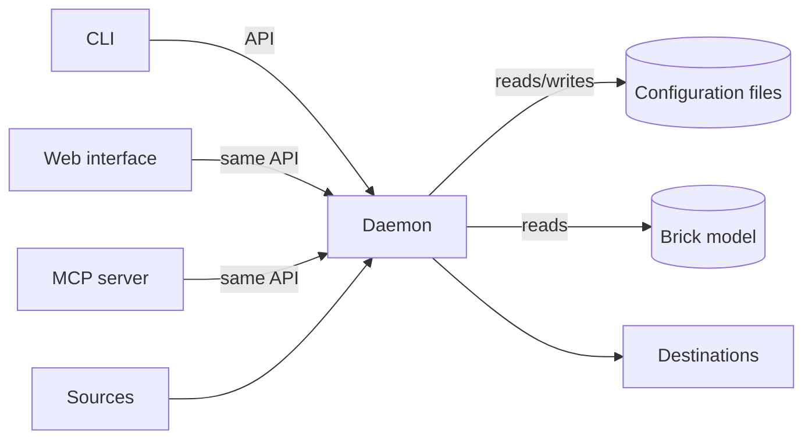

# Vision

## What is Bricklogger?

Bricklogger is a data bridge for building automation: the program collects
measurements **locally** from a building's automation systems over the most
common protocols — BACnet/IP, BACnet/MSTP, Modbus and Modbus/IP among others —
and writes them on to time-series databases, where they can be used for
analysis, visualisation and operations. External APIs can be added as sources
through custom plugins.

At the centre is a **[Brick](https://brickschema.org/) model of the
building**: a semantic graph describing the building, its equipment and its
data points. Sources are, generally speaking, defined in the Brick schema — the
model determines what exists and what is collected. Bricklogger takes the model
and logs the data.

## Principles

The core must be able to do everything; the user interfaces are equal doors
into the same functionality:

1. **CLI first.** The command line is the primary interface and is designed
   first. Everything the program can do can be done from the CLI — and thereby
   scripted and automated.

2. **No functionality may exist in only one interface.** The web interface has
   full parity with the CLI because both build on the same underlying layer.
   The UI is never the only way to anything.

3. **The Brick model is the centre.** The building, its equipment, its data
   points and the points' physical addresses are described in a Brick graph
   that Bricklogger reads but never changes. The configuration selects which
   of the model's points are logged — points cannot be defined outside the
   model.

4. **Transparent, declarative configuration.** The configuration lives in
   human-readable files that can be versioned in git and read without tools.
   Changes go through one validated layer (the daemon's API), so the
   configuration is always valid — but the file is the truth.

5. **Documentation first.** All functionality is described and approved in the
   documentation before it is implemented. The program contains no
   functionality that is not documented — and no functionality the user has
   not asked for.

## Overall shape

The system has four parts:

- **The daemon** is the long-running core that collects data from sources and
  writes to destinations.
- **The CLI** is the control plane: status, configuration, start/stop. When the
  daemon is not running, the CLI can work directly on the configuration files
  with the same validation.
- **The web interface** talks to the daemon's API and can do the same as the
  CLI.
- **The MCP server** lets an AI assistant read and change the configuration
  through the same API, and see what the daemon makes of it.

## Scope

The first version comprises:

- **The daemon, the CLI and the web interface.** The web interface is served
  by `bricklogger serve` and built on the same API as the CLI, so that parity
  is guaranteed.
- **Source: BACnet/IP.** More protocols (BACnet/MSTP, Modbus, Modbus/IP)
  follow in later versions.
- **Destination: TimescaleDB.**
- **Health/status endpoint** on the daemon for monitoring.
